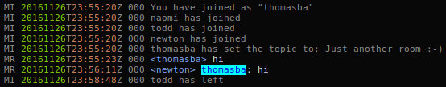

# mcabberlog

Highlighting for [mcabber](https://mcabber.com/) logfiles.

Example:


## Configuration

Although this is just a syntax-scheme there is one configuration option to
highlight defined words, e.g. your nickname.

```vim
" vimrc
" you also can highlight more than just one word, separate them by space.
let g:mcabber_mention='thomasba'
```

## Versions

- Version 0.6 (2016-11-27)
	- Moved keyword configuration for highlighting into vimrc
	- Highlight hidden messages from [lima-gold client](https://github.com/hackyourlife/lima-gold)
- Version 0.5 (2011-09-05)
	- Handle Status changes
- Version 0.4 (2011-09-05)
	- Fixed: show own kicks/bans correct
	- Fixed: Handling for kicks/bans + reason
- Version 0.3 (2011-09-03)
	- Fix for non MUC
